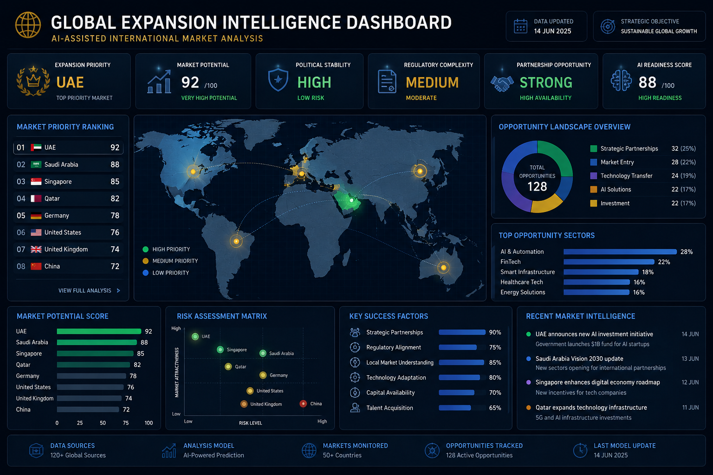
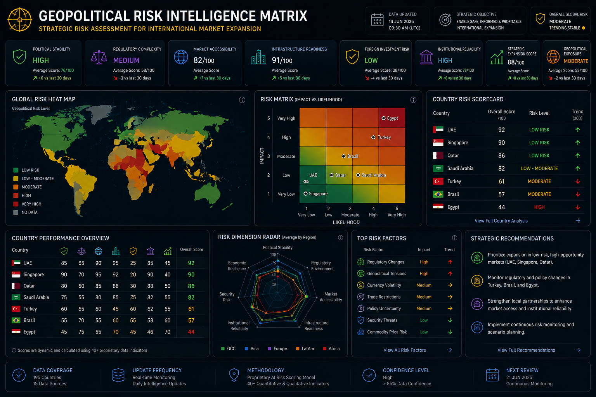

  

# AI Business Development Toolkit

### AI-Driven Business Development | Strategic Intelligence | International Expansion | Commercial Operations

A strategic portfolio focused on AI-assisted business development, international market expansion, geopolitical intelligence, commercial operations, and strategic partnerships.

This repository explores how artificial intelligence, market intelligence, and operational strategy can support scalable international business growth across emerging and global markets.

---

## Strategic Focus Areas

* AI-Assisted Commercial Operations
* International Market Expansion
* Strategic Partnerships & Ecosystem Intelligence
* Geopolitical & Regulatory Risk Analysis
* Executive Dashboards & Business Analytics
* AI Workflow Automation
* Government & Institutional Strategy
* International Growth Operations

---

# Featured Strategic Projects

| Project                        | Strategic Area                                            |
| ------------------------------ | --------------------------------------------------------- |
| Market Expansion Analysis      | International growth strategy and market prioritization   |
| AI Lead Qualification          | AI-assisted commercial intelligence workflows             |
| Geopolitical Business Risk     | Political, regulatory, and operational risk analysis      |
| Strategic Partnership Research | Partnership ecosystem mapping and strategic intelligence  |
| Automation Workflows           | AI-enhanced operational efficiency and automation systems |

---
# Executive Positioning

This repository reflects a strategic approach to combining:

* Artificial Intelligence
* International Business Development
* Commercial Operations
* Strategic Intelligence
* Market Expansion
* Geopolitical Risk Assessment
* Institutional & Government Relations

The objective is to explore how AI and business intelligence can support scalable international operations, strategic growth, and cross-border commercial expansion.

---

# Executive Dashboards

## Global Expansion Intelligence Dashboard

AI-assisted executive dashboard focused on international market prioritization, geopolitical intelligence, strategic partnerships, and commercial expansion opportunities.

  

---

## AI Commercial Operations Dashboard

Executive commercial intelligence dashboard focused on AI-assisted lead qualification, strategic pipeline monitoring, revenue operations, partnership analytics, and automation efficiency.

  

---

## Geopolitical Risk Intelligence Matrix

Strategic geopolitical intelligence dashboard designed to support international market expansion, regulatory risk assessment, institutional analysis, and cross-border operational strategy.

  

---

## International Expansion Strategic Framework

Strategic framework designed to support AI-enabled international expansion through market intelligence, geopolitical assessment, regulatory analysis, strategic partnerships, operational execution, and continuous optimization.

  

