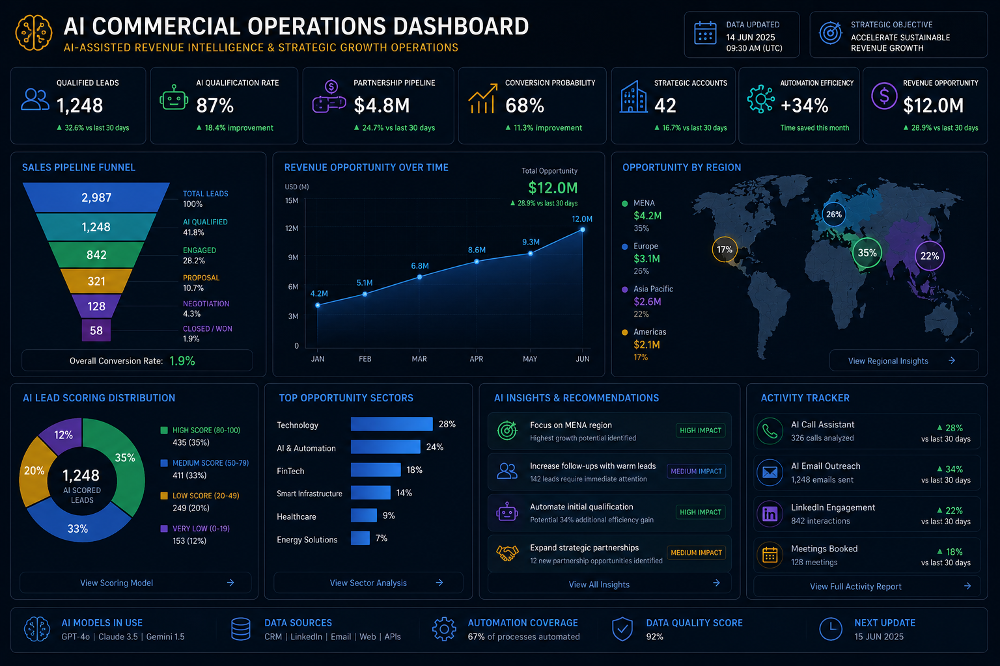

# Commercial Intelligence Concept Prototypes

This folder contains **conceptual dashboards and strategic analysis artifacts** developed while exploring the broader AI-assisted Commercial Intelligence portfolio.

The implemented portfolio hub now lives here:

**[AI Business Development Toolkit](https://github.com/Eambrosin/AI-Business-Development-Toolkit)**

The production-style portfolio applications are:

- [Lead Qualification & Revenue Prioritization](https://github.com/Eambrosin/lead-qualification-scorer)
- [Adaptive Outreach Intelligence](https://github.com/Eambrosin/outreach-sequence-generator)
- [Partnership Opportunity Finder](https://github.com/Eambrosin/partnership-opportunity-finder)

---

## What This Folder Contains

### [AI-Assisted Market Expansion Analysis](intelligence/market-expansion-analysis.md)
Concept note exploring how structured data and AI-assisted workflows can support market-expansion analysis.

### Global Expansion Intelligence Dashboard

Conceptual executive visualization for market prioritization and international expansion.

### AI Commercial Operations Dashboard

Conceptual visualization connecting pipeline intelligence, commercial prioritization and workflow automation.

### Geopolitical Risk Intelligence Matrix

Conceptual framework showing how geopolitical, regulatory and institutional considerations may be incorporated into expansion analysis.

### International Expansion Strategic Framework

Conceptual framework for structuring international expansion questions.

---

## Scope & Limitations

These are **concept prototypes**, not production applications, client dashboards or claims of proprietary market data.

They are retained because they show the evolution from visual strategic concepts toward the implemented, explainable applications in the current portfolio.

---

## Author

**Eduardo Ambrosin**  
International Business Development · Strategic Partnerships · GTM · Commercial Intelligence
